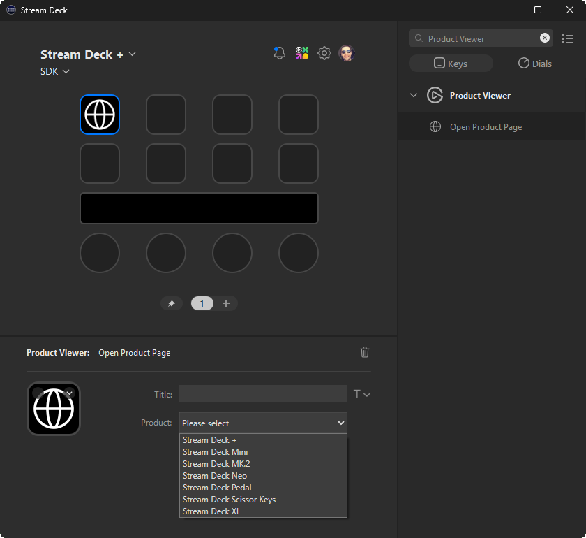

# Product Viewer



This sample plugin allows users to select a Stream Deck product from a drop-down within the property inspector, and then open that product's page within their default browser.

## SDK Functionality

The following SDK functionality is demonstrated as part of this plugin:

-   Using [sdpi-components](https://sdpi-components.dev/) to persist settings.
-   Populating components in property inspector using [data sources](https://sdpi-components.dev/docs/helpers/data-source).
-   Opening URLs in the user's default browser.

## Data Sources

Data sources within sdpi-components allow you to populate components within your property inspector, from your plugin. This can be useful when you need to rely on your plugin, for example you're using a native addon.

### Step 1. Property Inspector

Within your property inspector, specify a `datasource` attribute on the component you want to populate dynamically ([example](./com.elgato.data-sources.sdPlugin/ui/open-product-page.html#L15)).

<!-- prettier-ignore -->
```html
<sdpi-select
    setting="product"
    datasource="getProducts"
    loading="Fetching products..."
    placeholder="Please select">
</sdpi-select>
```

<!-- prettier-ignore-end -->

> [!NOTE]  
> Data sources are supported by `<sdpi-checkbox-list>`, `<sdpi-radio>`, and `<sdpi-select>`.

### Step 2. Plugin

With your component now requesting data, your plugin should listens for requests and respond with the data source; to do so, you must:

1. Override the `onSendToPlugin` method within your action ([example](./src/actions/open-product-page.ts#L25)).
2. Check if the payload includes an `event` ([example](./src/actions/open-product-page.ts#L27)).
3. Respond with the data source result using a specific [payload structure](https://sdpi-components.dev/docs/helpers/data-source#payload-structure) ([example](./src/actions/open-product-page.ts#L29)).

When put together, this should look as follows:

```ts
/**
 * Listen for messages from the property inspector.
 * @param ev Event information.
 */
override onSendToPlugin(ev: SendToPluginEvent<JsonValue, Settings>): Promise<void> | void {
    // Check if the payload is requesting a data source, i.e. the structure is { event: string }
    if (ev.payload instanceof Object && "event" in ev.payload && ev.payload.event === "getProducts") {
        // Send the product ranges to the property inspector.
        streamDeck.ui.current?.sendToPropertyInspector({
            event: "getProducts",
            items: this.#getStreamDeckProducts(),
        } satisfies DataSourcePayload);
    }
}
```
